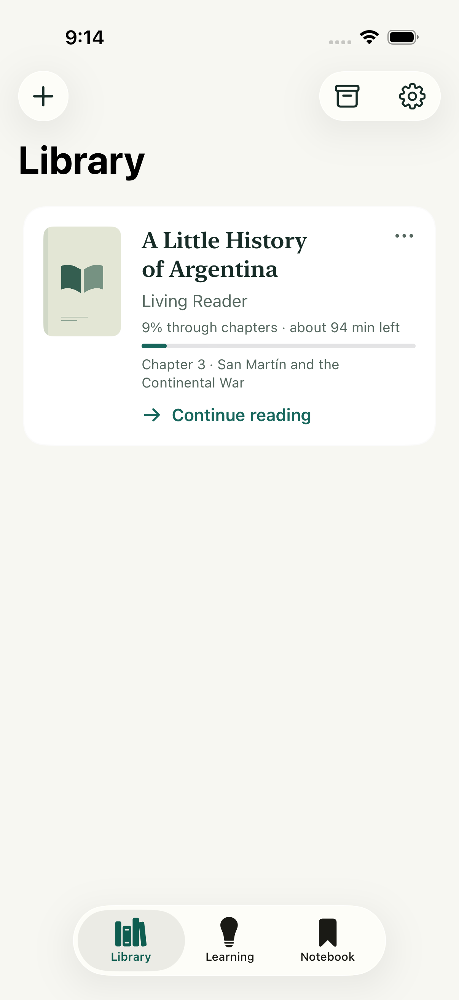
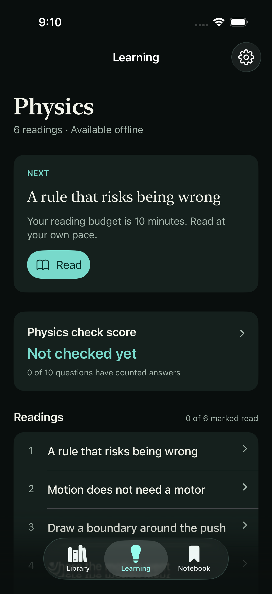
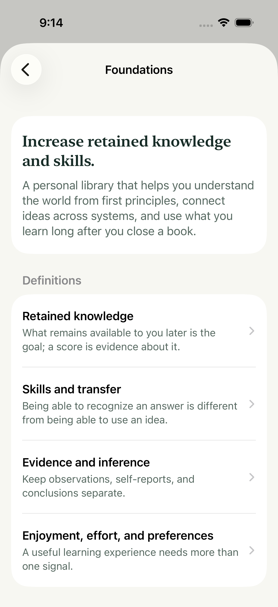

# GenBooks

**Read, understand, and remember.** GenBooks is a native iOS library and learning app with optional AI assistance.

Our mission is simple: **Increase retained knowledge and skills.** Our vision is a personal library that helps you reason from first principles, connect ideas across systems, and use what you learn later.

## In the app

Actual iPhone Simulator screens in light and dark appearance.

| Library | Learning | Foundations |
| --- | --- | --- |
|  |  |  |
| Open a saved book and resume reading. | Read the fixed Physics course and inspect your check results. | Explore the mission, vision, and definitions. |

## What is here

- **Library and Reader:** locally saved books, Scroll and Pages reading, adjustable typography, reading position, bookmarks, and revision history.
- **Notebook:** notes and saved words, with search and editing.
- **Learning:** an original, fixed Physics course with six readings, five concepts, practice, and a transparent Physics check score. The score records results on ten designated multiple-choice questions; it is not a mastery percentage.
- **Foundations:** the mission, learning definitions, evidence limits, and scoring policy, available in the app and [documentation](docs/foundations.md).
- **BookBot:** an optional online reading companion using a provider key you supply. Its replies are not independently source-verified.
- **Create:** text imports, ordinary AI generation, and a separate source-backed opening-preview workflow. [Their limits differ](docs/architecture.md#creation-and-adaptation).

Saved reading and the fixed Physics course work offline. Opening a book does not call AI. New AI replies, generation, retrieved sources, and uncached narration require a network and the relevant provider. This is an early native app, not an App Store approved release or a validated learning intervention.

## Start learning Physics

1. Open **Learning** and tap **Read** in the Next card, or choose a lesson under **Readings**.
2. Read the lesson and tap **Finish reading** to record that you finished it. Reading completion adds no check points.
3. Choose **Try an optional question**, then **Save my answer**, or **Skip**. If you open the explanation first, the app records help used.
4. Return later through **Review concept**, when suggested, or **Concepts → a concept → Practice this concept**. The question shows **Eligible for your check score** or **Practice only**, with the reason. Tap your score to inspect its evidence.
5. Open **Foundations** from Learning or the **Settings** gear for the definitions, learning rationale, score policy, and legend.

## Run locally

Use macOS with **Xcode 26 or later**, an iOS Simulator runtime, and [XcodeGen](https://github.com/yonaskolb/XcodeGen). The complete test script also uses Python 3. The deployment target is iOS 18. The Xcode project is generated from `project.yml`; the internal target and scheme remain `LivingReader`.

```sh
xcodegen generate
open LivingReader.xcodeproj
```

Choose the `LivingReader` scheme and an iPhone simulator, then Run. A physical-device build requires your own Apple development team and provisioning configuration. Configure app, share-extension, and shared-container identifiers consistently. Simulator development does not require a provider key.

Run the complete local verification with an explicitly selected simulator:

```sh
GENBOOKS_SIMULATOR_UDID='<your simulator ID>' ./scripts/check.sh
```

The gate includes unit tests, native interface tests, and two source-continuation journeys under an isolated simulator app identity. Live-provider checks remain opt-in. Quran-specific sample tests skip when the separately licensed resource is absent from a public checkout; a skip is not a passing content check. See [Contributing](CONTRIBUTING.md) and [App Store readiness](docs/app-store-readiness.md).

## Know the boundaries

Imports turn DRM-free EPUBs and text-based PDFs into structured text. Original layout, illustrations, and equation formatting may be lost; scanned PDFs have no OCR import. Imported books begin as **Canon**: imported wording rather than generated prose. Applying a supported change can promote the same book to **Living**, retaining its prior revisions.

The reader protects consumed chapter revisions; selected-word continuation also preserves the prefix through the chosen word. “Consumed” is a recorded chapter state, not eye tracking or proof that every visible word was read. The source-backed workflow retrieves one source and reviews an opening preview against it. It does not research and verify an entire textbook.

The app stores reading and learning data locally and has no account or shared sync backend. Web, SMS, iMessage, and phone-call interfaces are outside this project's current scope. See [data flow and privacy](docs/privacy.md).

## Documentation

| Read | Purpose |
| --- | --- |
| [Foundations](docs/foundations.md) | Mission, definitions, system map, complete diagram legend, evidence limits |
| [Physics check score](docs/physics-score.md) | Exact points, eligibility, migration, and examples |
| [Architecture](docs/architecture.md) | Components, storage, imports, AI, and failure behavior |
| [Design](docs/design.md) | Navigation, visual hierarchy, accessibility, and why the interface works this way |
| [Content provenance](docs/content-provenance.md) | What the project owns and which external rights remain separate |
| [Privacy](docs/privacy.md) | What stays local and what an online action sends |
| [App Store readiness](docs/app-store-readiness.md) | Concrete distribution requirements and unresolved work |

## License

Original project software, documentation, and explicitly identified original fixtures use the [MIT License](LICENSE). This does not relicense imported books, retrieved source material, third-party libraries, or artwork with separate terms. Preserve the [third-party notices](THIRD_PARTY_NOTICES.md). Contributions are welcome under [Contributing](CONTRIBUTING.md); report security issues using [Security](SECURITY.md).
