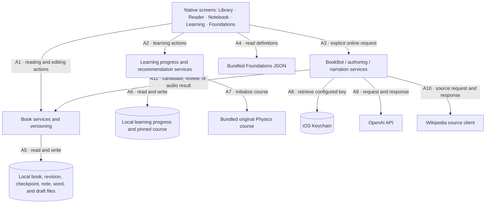

# Architecture

This page describes the native iPhone app. For the public web app and its separate account storage, see the [web documentation](../web/README.md).

GenBooks is a native SwiftUI app with a UIKit/TextKit reader. Books and learning records are stored locally. Optional online services author new material or answer questions; they are not dependencies of opening saved text.

## Component map

These arrows describe calls and data access, not psychological causation. Each box names a software responsibility; there are no stock, flow, plus/minus, or learning-effect claims in this diagram.

| Line | Exact meaning |
| --- | --- |
| A1 | Screens call book services for loading, imports, bookmarks, notes, saved words, checkpoints, and revision operations. |
| A2 | Learning screens record explicit actions and ask the recommendation service for a suggested activity. |
| A3 | The person invokes Ask, authoring, or Listen. Opening a saved book does not invoke these services. |
| A4 | Foundations renders a bundled, versioned content file. It does not ask a model to produce definitions. |
| A5 | Book services use app-owned local files. Revision activation enforces consumed-history and stale-candidate rules. |
| A6 | Learning saves its own evidence and preferences. Its ordinary read/practice/feedback actions do not modify Library manuscripts. |
| A7 | The bundled course initializes a pinned local course; an app resource update is not a silent rewrite of an existing learner's text. |
| A8 | Live provider services obtain the configured key through Keychain. A missing key prevents that provider action, not reading. |
| A9 | Online prompts or narration text go to OpenAI and results return to the requesting service. The network is optional for saved content. |
| A10 | Source-backed preview authoring retrieves an identified Wikipedia opening excerpt and its metadata. Ordinary BookBot chat does not perform this retrieval. |
| A11 | Authoring produces a candidate for validation/review before activation; narration produces cached audio. A reply in BookBot does not silently become book content. |

The diagram groups responsibilities; it does not imply one service object implements all three online workflows. Settings also use UserDefaults. Dictation uses Apple's Speech framework, with on-device recognition where available. [Privacy](privacy.md) covers those paths.

## Source layout and data

| Area | Responsibility |
| --- | --- |
| `App/`, `Features/Shell/` | App lifecycle, native navigation, settings, and shared appearance |
| `Features/Library/`, `Features/Reader/` | Library and reader screens; UIKit/TextKit layout and interaction |
| `Features/Ask/`, `Features/Create/` | Optional companion and authoring interfaces |
| `Features/Learning/` | Fixed course, question journeys, score evidence, and learning preferences |
| `Core/Models/` | Codable manuscript, revision, evidence, source, and learning structures |
| `Core/Persistence/` | File stores, import archives, seed loading, and progress persistence |
| `Core/Services/` | Versioning, import, generation, source retrieval/review, recommendations, speech, and narration |
| `Resources/` | Original course, Foundations, explicitly licensed sample material, and app assets |
| `ShareExtension/` | Receives supported files into the shared-container import inbox |

The manuscript structure is `Book → Chapter → ChapterRevision → ContentBlock`. JSON files in the app's Application Support container store books and associated records. Stores use atomic file replacement for individual saves; this is not a general transaction across every file. There is no account database or hosted synchronization service.

Consumed chapter revisions are pinned in a ledger. Completing a chapter or advancing beyond it can record consumption. This is a chapter-level state, not automatic detection of every word a person has seen. Selected-word continuation additionally freezes the text through the selected word. Old revisions support restoration; consumed history must remain unchanged.

## Creation and adaptation

| Workflow | Actual scope | Factuality boundary |
| --- | --- | --- |
| Paste / EPUB / PDF import | Convert supplied text to a local structured manuscript, initially Canon | No OCR for scanned PDFs; original layout, images, and math formatting are not preserved |
| Ordinary generated book | Brief and outline, then generated chapters; draft state supports retry | No automatic comprehensive web research. Evidence/checklist validation does not independently verify every assertion |
| Source-backed opening preview | Retrieve one Wikipedia opening excerpt; retain revision, attribution, license metadata, and source text; generate and separately review preview prose against it | Single-source support checking, not verification of an entire book or independent truth checking |
| Source-preview selected-word continuation | Rewrite the eligible unread suffix using the saved source, with fresh review and restorable revision | Supports more explanation or less detail; not images or later-chapter authoring |
| BookBot conversation | Send prompt and bounded reading context to the configured provider | General model knowledge is permitted; replies are not independently source-verified |

Canon-to-Living promotion changes the same book after a supported change is successfully applied; it is not a second duplicate book. The original revision remains available. Failed retrieval or review keeps source-backed candidates unpublished. Retrying a failed review can review the retained candidate without regenerating its prose. A stale candidate cannot replace a newer current revision.

Reading-time budgets and continuity/evidence structures constrain authoring requests and activation. They are not a guarantee that a generated work is factually complete or educationally effective. The original, fixed Physics course is a different path: its content is bundled and its progress is stored separately; no ongoing model call authors its next lesson.

The recommendation service uses recorded progress and due dates. A latest “too demanding” experience report can temporarily prioritize a brief reading only while its age is at least zero and less than 24 hours. Older or future-dated feedback does not override due reviews. That window is a product policy, not a measured recovery time.

## Offline behavior

Saved books, reading position, notes, words, the fixed course, and learning evidence are local. Provider outages do not remove them. New AI replies, authoring, and uncached OpenAI narration require online access and a configured key. Cached narration can play offline. Dictation may require Apple's network service when on-device recognition is unavailable.

A present but unreadable local record must produce a visible failure state and preserve the original bytes. It is not equivalent to a missing record, an empty library, or zero learning. Optional bundled samples can be absent in the public distribution; that is distinct from a corrupt sample. Existing saved books are not removed because a sample is omitted from a later app bundle.
