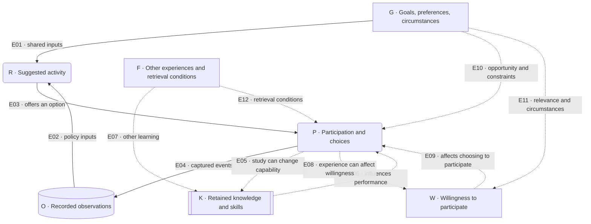

# Foundations

**Mission:** Increase retained knowledge and skills.

**Vision:** A personal library that helps you understand the world from first principles, connect ideas across systems, and use what you learn long after you close a book.

The in-app edition of these explanations comes from [`Resources/foundations.json`](../Resources/foundations.json). The [Physics check score](physics-score.md) defines the precise numerical policy. This page explains the human concepts and the system map; it does not claim that GenBooks has measured their causal effects.

## Reason from first principles

Start with observations, definitions, and explicit assumptions. Build an explanation from them, check where it applies, and ask what observation could contradict it. Distinguish a source's claim from your interpretation. An analogy can clarify an idea without proving it.

Systems thinking examines how interacting parts produce behavior over time. Feedback and delays matter. State the system boundary, define each part, and say what each connection means. A diagram is an explanation to examine, not evidence by itself.

## Definitions

**Retained knowledge** is information and understanding that remain available for later use. It is latent: an app cannot directly inspect it. **Skill** is the ability to perform a named action to a stated standard. **Transfer** is applying knowledge or skill in a different situation. These are the intended outcomes, not interchangeable scores.

**Performance** is what a person does on a particular task under particular conditions. It depends on knowledge, task demands, cues, assistance, and circumstances. A learning-science review distinguishes lasting learning from performance during practice; neither a smooth practice session nor a single later answer measures the entire underlying capability. [Soderstrom and Bjork, original review](https://doi.org/10.1177/1745691615569000).

**Observation** means a recorded event. **Self-report** means something the person says about their experience. **Inference** means a conclusion drawn from evidence. A reading marked finished, a correct answer, and “I feel I learned this” are different records. A source citation identifies provenance; checking support requires examining the relevant source text, and support from one source does not establish truth beyond it.

The Physics pilot asks multiple-choice questions. They can sample recognition or reasoning; they do not establish free recall, practical competence, or transfer to every new problem. Its score is a narrow observed proxy. Unknown and incorrect slots both contribute zero while remaining distinct states. Help, reading, and self-reports add no points.

## Experience without invented measurements

**Enjoyment** is how pleasant an activity feels. **Willingness** is an inclination to start, continue, or return. **Participation** is the action actually taken. Someone can willingly do a difficult exercise, or enjoy a subject and stop because of an appointment.

GenBooks records optional session feedback—enjoyable, neutral, or too demanding. It does not continuously measure enjoyment, turn it into a stock, or infer motivation from silence. The feeling of learning and tested performance can diverge; a controlled introductory-physics study illustrates that distinction, without estimating any GenBooks effect. [Deslauriers and colleagues, original study](https://doi.org/10.1073/pnas.1821936116).

A preference for diagrams, audio, examples, or shorter passages is a real choice or access need. It does not establish a fixed learner type. A review found insufficient support for prescribing instruction by matching a diagnosed learning style. That is different from claiming that every individual difference is irrelevant. [Pashler and colleagues, original review](https://doi.org/10.1111/j.1539-6053.2009.01038.x).

## From learning evidence to product decisions

GenBooks offers optional practice, returns to concepts later, and keeps answer evidence separate from reading and experience reports. Retrieval practice means trying to bring learned information to mind. Research motivates these choices; the exact scoring and scheduling rules remain inspectable product policies.

| Decision in this pilot | Relevant primary evidence | What the implementation establishes |
| --- | --- | --- |
| Offer a question after reading; retain answers and help conditions | Retrieval tests improved delayed retention of prose relative to repeated study in [Roediger and Karpicke (2006)](https://doi.org/10.1111/j.1467-9280.2006.01693.x). | A check can be practice as well as observation. Those free-recall experiments—recalling without answer choices—do not validate this multiple-choice score. |
| Suggest later practice and require recorded spacing for scored checks | Useful study gaps depended on the intended retention interval in [Cepeda and colleagues (2008)](https://doi.org/10.1111/j.1467-9280.2008.02209.x). | The 24-hour and seven-day eligibility rules are explicit choices, not universal optimal intervals or a fitted forgetting curve. |
| Keep question identities and results visible across several questions per concept | Repeated testing improved performance on new inferential questions one week later in [Butler (2010)](https://doi.org/10.1037/a0019902). | The bank has 17 multiple-choice questions; familiar-item results do not establish transfer. Separately assessed new problems remain future work. |
| Record experience feedback separately from points | Reported feelings of learning and test performance diverged in the controlled physics study by [Deslauriers and colleagues (2019)](https://doi.org/10.1073/pnas.1821936116). | Enjoyment and “too demanding” reports can inform suggestions without becoming knowledge evidence. |
| Keep questions optional, reading accessible, and score changes explained | Informational versus controlling reward contexts mattered in [Ryan, Mims, and Koestner (1983)](https://selfdeterminationtheory.org/SDT/documents/1983_RyanMimsKoestner.pdf). | Our design inference is to make feedback informative and preserve choice. This does not establish that all points harm motivation or that this score improves it. |

## System map

The map separates the app's observable feedback loop from human influences it does not fully observe. The solid lines describe product relationships. Dashed lines describe possible human influences, not estimated effects.

### Every box

| Box | Definition | What the app knows |
| --- | --- | --- |
| **K — Retained knowledge and skills** | Persistent understanding and learned capabilities; a conceptual accumulation, not a single measured quantity | Samples of performance, not direct access to K |
| **W — Willingness** | Current inclination to participate in a particular activity | No measured willingness field; inactivity is not a diagnosis |
| **P — Participation and choices** | Reading, responding, asking for help, switching, skipping, or stopping | Only instrumented events and explicit reports; a tap does not prove attention |
| **O — Recorded observations** | Distinct events, answers, assistance conditions, dates, and self-reports | Local records with known limits; the Physics score summarizes only eligible designated answers |
| **R — Suggested activity** | A reading or review proposed by an implemented rule | The actual rule and its inputs; “suggested” does not mean optimal |
| **G — Goals, preferences, circumstances** | Purposes, format choices, time, interruptions, fatigue, and other constraints | Only the subset shared with the app; unrelated influences remain unknown |
| **F — Other experiences and retrieval conditions** | Other learning plus conditions such as cues and competing information | Not comprehensively recorded; F is a collection of influences, not a scalar |

### Every line

| Line | Meaning and limit |
| --- | --- |
| **E01 G → R** | Shared goals and preferences can inform a suggestion or its wording. Unreported circumstances are not available inputs. |
| **E02 O → R** | The implemented policy uses selected records to propose an activity. Not every recorded field drives the recommendation, and due does not mean forgotten. |
| **E03 R → P** | The app offers an option. The person may choose, change, or decline it. |
| **E04 P → O** | Captured events and submitted reports become records. Unobserved reading and unreported help remain unknown. |
| **E05 P ⇢ K** | Study and practice can change knowledge or skill. Skips and stops are not learning gains; practice may also reinforce a misunderstanding. |
| **E06 K ⇢ P** | Existing knowledge can affect comprehension and answers. It is one influence among several. |
| **E07 F ⇢ K** | Other learning or relearning can change retained capability. A changed answer alone does not identify that change. |
| **E08 P ⇢ W** | The experience of an activity can change willingness to return. Its direction varies; enjoyment, effort, and frustration are not one balance. |
| **E09 W ⇢ P** | Willingness can affect a choice to participate. Time and opportunity can still prevent participation. |
| **E10 G ⇢ P** | Goals and circumstances affect available or chosen actions. Stopping can reflect an interruption. |
| **E11 G ⇢ W** | Relevance and circumstances can influence willingness. This is not a fixed learning-style rule. |
| **E12 F ⇢ P** | Cues, context, or competing information can change expressed performance without establishing a change in K. This route concerns performance, not every action in P. |

### Legend

- **Box shapes:** the double-sided K box marks persistent human capability; rounded P and R boxes mark an action or proposal; the cylindrical O box marks stored records; other rectangles mark human state or context. Shape does not imply a numerical unit. Letters are identities, not scores.
- **Solid arrow:** an implemented information, offer, or recording relationship; read its verb. **Dashed arrow:** a possible human influence with no fitted effect size or guaranteed direction.
- **Stock:** something that persists and can accumulate. K is stock-like conceptually, but no calibrated amount of knowledge or skill is stored. W and enjoyment are not modeled as reservoirs.
- **Flow:** a rate that changes a stock over time. None of E01–E12 is a measured stock-flow transfer. In a different stock-flow model, a learning rate could add capability; GenBooks does not calculate such a rate.
- **Forgetting:** less reliable access to previously learned material under later conditions. **Interference:** competing information making retrieval harder. A wrong answer does not establish permanent erasure; this map has no literal “forgetting sink.”
- **Feedback loop:** a closed chain in which an outcome affects later input. R → P → O → R is the app's observable loop. P ⇢ K ⇢ P and P ⇢ W ⇢ P are conceptual human loops, not implemented numerical models.
- **Reinforcing / balancing:** a reinforcing loop can amplify a change; a balancing loop can oppose it. These labels are not good/bad judgments. This map assigns neither label because its human relationships have no fixed signs.
- **Plus / minus:** in a signed causal diagram, + means more of the cause tends to produce more of the effect with other conditions fixed; − means less. Signs do not give effect size, certainty, desirability, or score points. No causal signs are assigned here. The score's +10 and −10 are a separate arithmetic policy.
- **Delay:** a gap between an event and an effect or observation. The map allows effects over time but estimates no delay length. The 24-hour and seven-day eligibility rules are product choices, not measured memory-process constants.

## Current implementation boundary

The fixed Physics course and its local progress are separate from the generative Library. Preferences do not rewrite its readings. BookBot can discuss a lesson online using general model knowledge; it does not independently verify those replies or turn them into scored evidence. A source-backed authoring failure leaves the candidate unpublished and existing reading available.

The public project implements native iOS reading and learning. Web, SMS, iMessage, and phone-call learning interfaces are excluded because there is no shared backend. The system map expresses a design rationale, not proof of improved retention or an autonomous adaptive curriculum.
